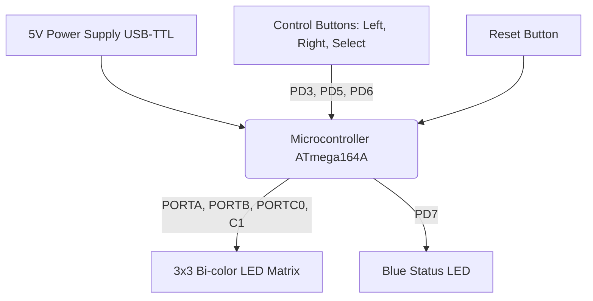

# Tic-Tac-Toe on ATmega164A
A hardware-based Tic-Tac-Toe game developed in C for an AVR microcontroller. The project features a custom-built 3x3 bi-color LED matrix display and push-button inputs to facilitate a Player vs. Computer interactive game loop.

## 📌 Project Overview
The system allows a human player ("X" - Red LEDs) to compete against the computer ("0" - Green LEDs). The game logic is handled entirely on the microcontroller which registers inputs, calculates the computer's moves and checks for win/draw conditions (vertical, horizontal or diagonal alignment). 

## 🛠️ Hardware Setup
The physical prototype was designed and manually assembled (THD components) with the following specifications:
* **Microcontroller:** ATmega164A (programmed via USB-TTL at 5V).
* **Display:** 3x3 Matrix utilizing 9 bi-color (Red/Green) Common Cathode LEDs.
* **Inputs:** 3 tactile push-buttons for game navigation (`Left`, `Right`, `Select`) and 1 hardware `Reset` button.
* **Status Indicator:** 1 Blue LED to indicate power/active status.
* **Passive Components:** 8x 660Ω resistors, 8x 470Ω resistors, 1x 100Ω resistor.

### Pin Mapping
* **Bi-color LEDs:** Connected to Ports `A`, `B`, `C0` and `C1`.
* **Control Buttons:** Connected to `PD3` (Left), `PD5` (Right) and `PD6` (Select).
* **Status LED:** Connected to `PD7`.

## 💻 Software Architecture
The firmware was developed entirely in C and compiled using **Microchip Studio**. 

**Key Software Features:**
* **2D Array Mapping:** The physical LED matrix is mapped to a 3x3 virtual 2D array in software to manage the game state.
* **Game Loop & State Management:** Evaluates the board after every turn. When a win condition or a draw is detected the board flashes the winner's color and auto-resets after a few seconds.
* **I/O Control:** Direct register manipulation for port configuration and LED multiplexing.

## ⚙️ Tools & Technologies Used
* **Firmware Development:** Microchip Studio, C
* **Flashing:** AVR Buster
* **Hardware Design & Simulation:** OrCAD Capture, Proteus 8

## 📸 The Prototype

## 👥 Team & Acknowledgements
This project was developed as a collaborative academic project.
* **Contributors:** Catalina Ionescu & Nedelcu Mihaela Antonia.
